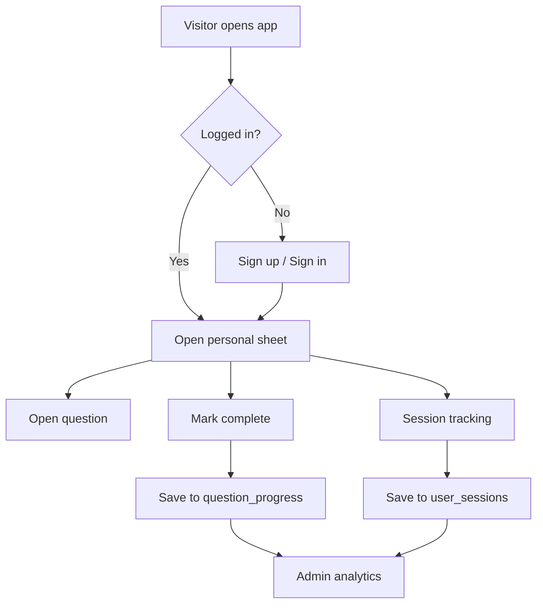

# DSA-Sheet-

DSA-Sheet- is a full-stack DSA practice tracker built for consistent prep, personal progress, and clean admin analytics.

Users can:
- sign up and sign in
- solve questions from a structured DSA sheet
- mark questions complete
- keep their own progress synced across sessions

Admins can:
- view user activity
- track solved counts
- monitor time spent on the platform

## Preview

```text
Public App
┌──────────────────────┐
│ Login / Signup       │
│ 500-question sheet   │
│ Mark done / Search   │
│ Progress sync        │
└──────────┬───────────┘
           │
           ▼
     Supabase Auth
           │
           ▼
     Supabase Database
   ┌────────┼──────────┐
   │        │          │
   ▼        ▼          ▼
profiles question_progress user_sessions
           │
           ▼
      Admin Dashboard
```

## Highlights

- 500 curated DSA questions
- direct `Solve` links with `Search` fallback
- per-user saved progress using Supabase
- separate `/admin` route
- row-level security policies in SQL
- responsive UI for desktop and mobile

## Tech Stack

- React
- Vite
- Supabase Auth
- Supabase Postgres
- CSS

## Project Structure

```text
src/
├─ admin/
│  └─ AdminApp.jsx
├─ components/
│  ├─ AuthScreen.jsx
│  └─ SetupScreen.jsx
├─ lib/
│  └─ supabase.js
├─ user/
│  └─ PublicApp.jsx
├─ App.jsx
├─ icons.jsx
├─ main.jsx
├─ questions.js
└─ styles.css

supabase/
└─ schema.sql
```

## User Flow



## Database Design

### `profiles`

Stores one row per user.

| Column | Purpose |
|---|---|
| `id` | Matches `auth.users.id` |
| `email` | User login email |
| `full_name` | Display name |
| `is_admin` | Admin access flag |
| `created_at` | Account creation time |
| `last_seen_at` | Latest activity time |

### `question_progress`

Stores progress per user per question.

| Column | Purpose |
|---|---|
| `user_id` | User reference |
| `question_id` | DSA sheet question id |
| `is_completed` | Completion state |
| `completed_at` | Completion timestamp |
| `updated_at` | Last update time |

### `user_sessions`

Tracks session start and activity time.

| Column | Purpose |
|---|---|
| `id` | Session id |
| `user_id` | User reference |
| `started_at` | Session start |
| `last_seen_at` | Last heartbeat |
| `ended_at` | Session end |

## Setup

### 1. Install dependencies

```bash
npm install
```

### 2. Add environment variables

Create `.env`:

```env
VITE_SUPABASE_URL=https://your-project-ref.supabase.co
VITE_SUPABASE_ANON_KEY=your-anon-key
```

### 3. Create database objects

Run:

```sql
supabase/schema.sql
```

inside the Supabase SQL editor.

### 4. Disable email confirmation

In Supabase Auth settings, disable email confirmation if you want instant signup without email verification.

### 5. Make your first admin

Sign up once from the app, then run:

```sql
update public.profiles
set is_admin = true
where email = 'your-email@example.com';
```

### 6. Start development

```bash
npm run dev
```

## Routes

- `/` public user app
- `/admin` admin analytics dashboard

## Solve Link Strategy

Each question has:
- a direct `Solve` link to the problem page when possible
- a `Search` fallback when the direct slug is uncertain

This keeps the experience fast while still handling renamed or uncommon problems.

## Security Notes

- `.env` is ignored by Git
- `service_role` key is never used in the frontend
- user data is protected through Supabase Row Level Security
- admin access is controlled through `profiles.is_admin`

## Commands

```bash
npm run dev
npm run build
npm start
```

## Why This Project

Most DSA sheets stop at listing questions.

This one is built to feel like a real product:
- personal login
- saved progress
- session tracking
- admin visibility
- cleaner practice workflow

## Status

Current build includes:
- auth
- question tracking
- admin analytics
- Supabase schema
- responsive UI

Next natural upgrades:
- streaks
- notes per question
- company tags
- revision mode
- leaderboard
